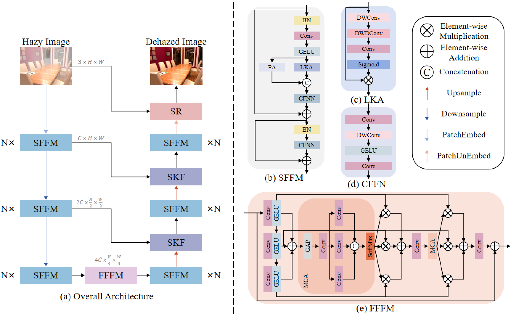
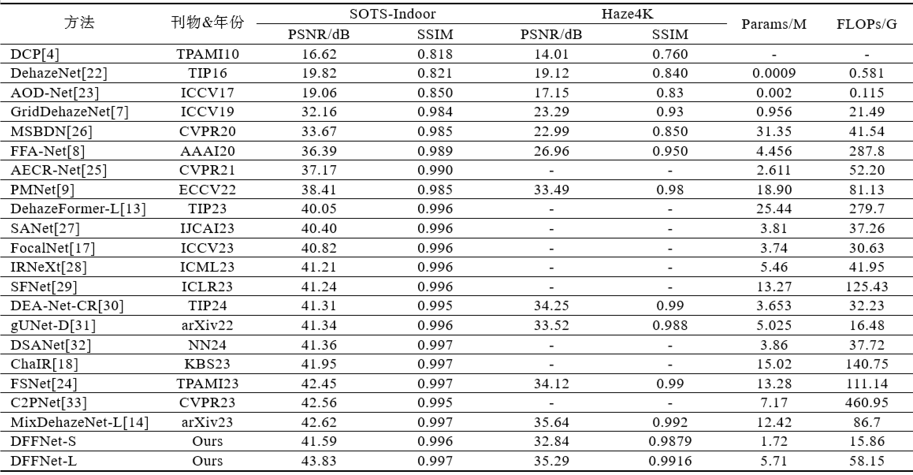

# 基于双域特征融合的图像去雾网络
>**摘要:**
图像去雾的目标是从有雾图像中恢复潜在的无雾图像. 现有方法利用清晰/退化图像对在空间域和频率域的差异进行去雾并取得一定的效果, 但是仍存在双域特征融合中空间域特征提取与融合不够充分、 频率域特征融合效果不佳等问题. 为此, 提出一种新颖的双域特征融合网络DFFNet. 首先, 设计更适合图像软重建的空间域特征融合模块SFFM, 采用Transformer风格架构, 并引入大核注意力与像素注意力, 通过不同感受野分别对全局特征和局部特征进行建模, 并通过卷积前馈网络进行映射与融合. 同时, 设计频率域特征融合模块FFFM, 使用卷积层来放大并丰富高频特征, 并采取一种新颖的特征融合策略, 利用通道交互来强调与融合多种高频特征. 结合这两种关键设计提出的DFFNet在两个基准数据集上展现出与最先进方法相当甚至更好的性能. DFFNet-L是第一个在SOTS-Indoor数据集上峰值信噪比(peak signal-to-noise ratio, PSNR)超过43dB的去雾方法, PSNR为43.83dB. 代码发布于https://github.com/WWJ0720/DFFNet.
# Image Dehazing Network Based on Dual-domain Feature Fusion

>**Abstract:**
The goal of image dehazing is to restore the latent haze-free image from a hazy image. Existing methods utilize the differences between clear/degraded images pairs in both spatial-domain and frequency -domain for dehazing and achieve some achievement. However, there are still issues with insufficient spatial -domain feature extrac-tion and fusion, as well as unsatisfactory frequency-domain feature fusion in dual-domain feature fusion. To address this, a novel dual-domain feature fusion network called DFFNet is proposed. Firstly, a spatial-domain feature fusion module (SFFM) is designed, which is more suitable for image soft reconstruction. It adopts a Transformer-style architecture and incorporates large kernel attention and pixel attention to model global and local features separately using different receptive fields, and performs mapping and fusion through a convolu-tional feed-forward network. Simultaneously, a frequency-domain feature fusion module (FFFM) is designed, which uses convolutional layers to amplify and enrich high-frequency features. It employs a novel feature fusion strategy that emphasizes and fuses multiple high-frequency features through channel interaction.volutional. Combining these two key designs, the proposed DFFNet demonstrates comparable or even better performance than state-of-the-art methods on two benchmark datasets. DFFNet-L is the first dehazing method to achieve a peak signal-to-noise ratio (PSNR) exceeding 43dB on the SOTS-Indoor dataset, with a PSNR of 43.83dB. The code has been released on https://github.com/WWJ0720/DFFNet.

## DFFNet框架:

## 实验结果:

## 数据集:
数据集的准备参考[Dehazeformer](https://github.com/IDKiro/DehazeFormer#vision-transformers-for-single-image-dehazing), 数据集的格式与Dehazeformer中的相同. 
请将数据集按照以下目录结构组织:

`Your path`  
`├──RESIDE-IN`  
     `├──train`   
          `├──GT`   
          `└──hazy`  
     `└──test`   
          `├──GT`   
          `└──hazy`  
`└──Haze4K`  
     `├──train`   
          `├──GT`   
          `└──hazy`  
     `└──test`   
          `├──GT`   
          `└──hazy` 

## 预训练权重(weights)、实验结果(results)和消融实验的模型和权重(ablation_experiments):
[google drive](https://drive.google.com/drive/folders/1kMDQ7F9MjaakNh4TbCTrDoz023XxmKE_?usp=drive_link)\
[百度网盘](https://pan.baidu.com/s/1p8TFFrlsvITD10LJ1Kqg8g?pwd=0720)\
[夸克网盘](https://pan.quark.cn/s/b0385972c564)

## 准备环境
~~~
conda create -n DFFNet python=3.9
conda activate DFFNet
conda install pytorch torchvision torchaudio pytorch-cuda=12.1 -c pytorch -c nvidia
pip install -r requirements.txt
~~~

## 训练
~~~
# 在RESIDE-IN数据集上进行训练
python train_indoor.py --data_dir your_path --dataset RESIDE-IN --model DFFNet_L --gpu 0,1,2,3
# 在Haze4K数据集上进行训练
python train_haze4k.py --data_dir your_path --dataset Haze4K --model DFFNet_L --gpu 0,1,2,3
~~~

## 测试
~~~
# 在RESIDE-IN数据集上进行测试
python test_indoor.py --data_dir your_path --dataset RESIDE-IN --model DFFNet_L --saved_weight_dir weight_path
# 在Haze4K数据集上进行测试
python test_haze4k.py --data_dir your_path --dataset Haze4K --model DFFNet_L --saved_weight_dir weight_path
~~~

## 帮助:
如果您有任何问题, 请发邮件联系wwj20000720@163.com.

